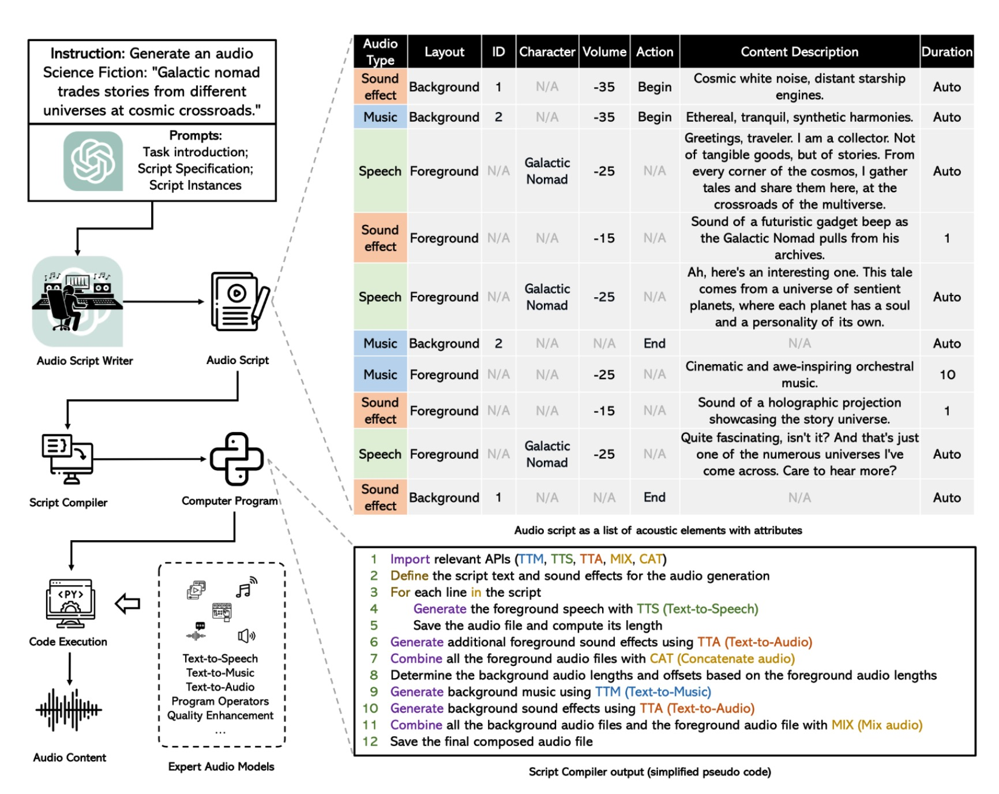

# <span style="color: blue;">🎵</span> WavJourney: Compositional Audio Creation with LLMs
This repository contains the official implementation of "WavJourney: Compositional Audio Creation with Large Language Models"

Starting with a text prompt, WavJourney can create audio content with engaging storylines encompassing personalized speakers, lifelike speech in context, emotionally resonant music compositions, and impactful sound effects that enhance the auditory experience. 

<p align="center">
  
</p>

<hr>


## Preliminaries
1. Install the environment:
```bash
bash ./scripts/EnvsSetup.sh
```
2. Activate the conda environment:
```bash
conda activate WavJourney
```

3. (Optional) You can modify the default configuration in `config.yaml`, check the details described in the configuration file. 
4. Pre-download the models (might take some time):
```bash
python scripts/download_models.py
```

5. Set the WAVJOURNEY_OPENAI_KEY in the environment variable for accessing [GPT-4 API](https://platform.openai.com/account/api-keys) [[Guidance](https://help.openai.com/en/articles/7102672-how-can-i-access-gpt-4)]
```bash
export WAVJOURNEY_OPENAI_KEY=your_openai_key_here
```

6. Set environment variables for using API services.
```bash
# Set the port for the WAVJOURNEY service to 8021
export WAVJOURNEY_SERVICE_PORT=8021

# Set the URL for the WAVJOURNEY service to 127.0.0.1
export WAVJOURNEY_SERVICE_URL=127.0.0.1

# Limit the maximum script lines for WAVJOURNEY to 999
export WAVJOURNEY_MAX_SCRIPT_LINES=999
```


7. Start Python API services (e.g., Text-to-Speech, Text-to-Audio)
```bash
bash scripts/start_services.sh
```

## Web APP
 ```bash
bash scripts/start_ui.sh
  ```

## Commandline Usage
 ```bash
 python wavjourney_cli.py -f --input-text "Generate a one-minute introduction to quantum mechanics" 
 ```


## Kill the services
You can kill the running services via this command:
 ```bash
python scripts/kill_services.py
  ```
  
## (Advanced features) Speaker customization 
You can add voice presets to WavJourney to customize the voice actors. Simply provide the voice id, the description and a sample wav file, and WavJourney will pick the voice automatically based on the audio script. Predefined system voice presets are in `data/voice_presets`.

You can manage voice presets via UI. Specifically, if you want to add voice to voice presets. Run the script via command line below:
```bash
python add_voice_preset.py --id "id" --desc "description" --wav-path path/to/wav --session-id ''
```
What makes for good voice prompt? See detailed instructions <a href="https://github.com/gitmylo/bark-voice-cloning-HuBERT-quantizer">here</a>. 
## Hardware requirement
- The VRAM of the GPU in the default configuration should be greater than 16 GB.
- Operation system: Linux.

## Appreciation
- [Bark](https://github.com/suno-ai/bark) for a zero-shot text-to-speech synthesis model.
- [AudioCraft](https://github.com/facebookresearch/audiocraft) for state-of-the-art audio generation models.

## Disclaimer
We are not responsible for audio generated using semantics created by this model. Just don't use it for illegal purposes.


