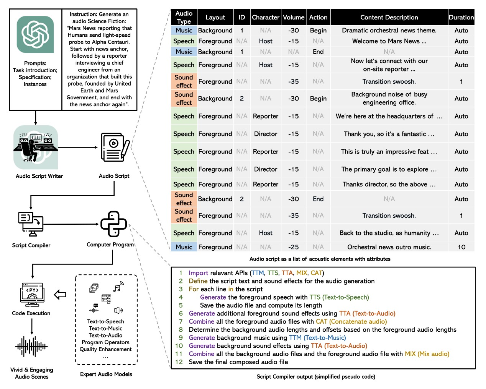

# 🎵 WavJourney: Compositional Audio Creation with LLMs
   

This repository contains the official implementation of ["WavJourney: Compositional Audio Creation with Large Language Models"](https://audio-agi.github.io/WavJourney_demopage/).

Starting with a text prompt, WavJourney can create audio content with engaging storylines encompassing lifelike speech in context, emotionally resonant music compositions, and impactful sound effects that enhance the auditory experience.  

Check the examples and demonstration video in the [Demo Page](https://audio-agi.github.io/WavJourney_demopage/)!

  

We will be releasing the code & software very soon! Please stay tuned for further updates and more details!
